# HEAL Unified Structured Pruning and Mixed-Precision Search

本项目提供面向车路协同感知模型的统一、部署闭环搜索框架。它在同一个合法搜索空间中联合搜索结构化剪枝宽度和逐层精度，并以真实 TensorRT 子网反馈约束 GA，而不是只用理论 BOPS 或未物理化的掩码模型排序。

当前正式支持四个 HEAL LiDAR 模型族：

- Pyramid
- DiscoNet
- F-Cooper
- V2X-ViT

仓库只包含源代码、配置模板和测试。数据集、原始 checkpoint、校准样本、ONNX、TensorRT engine、搜索日志和评估输出必须由使用者在运行时通过相对路径显式提供或指定，不属于版本库内容。

## 方法概览

```mermaid
flowchart LR
    A[HEAL model and checkpoint] --> B[Graph tracing]
    B --> C[Coupled legal pruning domains]
    B --> D[Layer-wise precision groups]
    C --> E[Taylor and Fisher proxy cache]
    D --> E
    E --> F[Greedy anchor search]
    F --> G[Beam budget recovery]
    G --> H[Strict BOPS anchor]
    H --> I[64-parent and 64-offspring GA]
    I --> J[Top-5 new candidates per generation]
    J --> K[Physical pruning and explicit Q/DQ]
    K --> L[TensorRT build and realization audit]
    L --> M[Fixed-manifest accuracy and latency]
    M --> N[Accuracy gate and real-subnetwork feedback]
    N --> I
    N --> O[Best deployable engine]
```



完整目标由三部分组成：

`J_total = J_struct + J_WQ + J_AQ`

- `J_struct`：合法耦合结构域上的剪枝 Taylor/Fisher 代价。
- `J_WQ`：保留权重从高精度切换到相邻低精度时的量化扰动代价。
- `J_AQ`：可选的激活 Q/DQ 扰动代价；关闭时严格记为零，开启但缺少统计时失败关闭。

Stage 1 只允许 `abs(R_BOPS - target) <= 0.005` 的候选进入排序。Stage 2 会物理化结构、导出显式 Q/DQ ONNX、构建 strongly typed TensorRT engine、核对请求/实现精度，并在冻结评估清单上测量 mAP 与时延。GA 候选还必须满足：

`candidate_mAP >= greedy_anchor_mAP - 0.005`

## 正式协议

默认 V3 协议固定如下：

| 项目 | 正式值 |
| --- | ---: |
| 父代 | 64 |
| 子代 | 64 |
| Stage 2 每代最多新候选 | 5 |
| 正式进化代数 | 10 |
| generation 0 | 仅初始化，不计入 10 代 |
| BOPS 绝对容差上限 | 0.005 |
| Greedy 精度门容差上限 | 0.005 mAP |
| CNN 每代 Top-5 筛选 | 300 帧，warmup 100 帧 |
| CNN 每代胜者复评 | 500 帧，warmup 200 帧 |
| V2X-ViT 每代 Top-5 筛选 | 500 帧，warmup 200 帧 |
| 每预算最终胜者验证 | 1789 帧，warmup 200 帧 |

Greedy 使用同一合法邻域和同一代理目标。直接轨迹无法进入预算带时，搜索会使用确定性的合法邻居 beam recovery；不会通过静默投影、通道补齐或事后 BOPS 修复伪造可行候选。

## 目录

```text
heal_compress/
├── pruning/                 # 结构化剪枝、依赖与物理化
├── quantization/            # 精度映射、显式 Q/DQ、TensorRT 插件
├── search/
│   ├── configs/unified/     # 四模型公开配置模板
│   ├── ga/                  # strict Stage 1/Stage 2 GA
│   ├── greedy/              # Greedy 与 beam recovery
│   ├── orchestration/       # 模型族正式执行器
│   ├── stage2/              # engine 构建、精度审计与评估
│   └── unified/             # 统一公开入口
├── scripts/                 # 数据清单、部署和辅助入口
├── tests/                   # 单元与契约测试
└── tools/check_public_release.py
```

`docs/` 是本地迭代维护目录，整个目录被公开发布检查拒绝，不会上传。

## 环境

建议建立独立环境，Python、CUDA、PyTorch、HEAL、ModelOpt 与 TensorRT 的版本必须彼此兼容：

```bash
conda create -n heal-unified-search python=3.10 -y
conda activate heal-unified-search
pip install -r requirements.txt
```

TensorRT/ModelOpt 可位于仓库外部。所有路径均从项目根目录解析，配置和命令中只使用相对路径。例如，当相邻目录保存 HEAL、TensorRT 和模型时：

```text
../HEAL
../TensorRT-10.9_x86_cu118
../model_zoo
../search_runs
```

不要把机器用户名、home 目录或数据盘绝对路径写进配置、脚本或环境变量。需要环境变量时也只赋相对值：

```bash
export MODEL_ROOT=../model_zoo
export TENSORRT_ROOT=../TensorRT-10.9_x86_cu118
export CALIBRATION_MANIFEST=../calibration/train_manifest.json
export EVALUATION_MANIFEST=../calibration/validation_manifest.json
export BASELINE_ENGINE=../model_zoo/baselines/strict_fp32.plan
```

## 统一入口

列出正式支持的模型：

```bash
python -m search.unified --list-families
```

只校验配置、模型族注册和调用计划，不加载模型、不构建 engine：

```bash
python -m search.unified \
  --config search/configs/unified/lidar_pyramid_ga.yaml \
  --output-root ./outputs/pyramid_dry_run \
  --dry-run
```

四个模板分别为：

```text
search/configs/unified/lidar_pyramid_ga.yaml
search/configs/unified/lidar_disco_ga.yaml
search/configs/unified/lidar_fcooper_ga.yaml
search/configs/unified/lidar_v2xvit_ga.yaml
```

### Pyramid

一个命令会先搜索并真实部署验证全部六个 Greedy 锚点；只有六个预算均通过后，才会启动正式 GA：

```bash
python -m search.unified \
  --config search/configs/unified/lidar_pyramid_ga.yaml \
  --checkpoint ../model_zoo/lidar_pyramid/model.pth \
  --model-config ../model_zoo/lidar_pyramid/config.yaml \
  --heal-root ../HEAL \
  --tensorrt-root ../TensorRT-10.9_x86_cu118 \
  --calibration-manifest ../calibration/pyramid_train.json \
  --plugin quantization/plugins/pointpillar_scatter_trt/build/libpointpillar_scatter_trt.so \
  --output-root ../search_runs/pyramid_ga
```

### DiscoNet 与 F-Cooper

两者使用相同入口，并额外显式传入同模型族的严格 FP32 基线 engine。将 `<family>` 分别替换为 `disco`、`fcooper`：

```bash
python -m search.unified \
  --config search/configs/unified/lidar_<family>_ga.yaml \
  --checkpoint ../model_zoo/lidar_<family>/model.pth \
  --model-config ../model_zoo/lidar_<family>/config.yaml \
  --heal-root ../HEAL \
  --tensorrt-root ../TensorRT-10.9_x86_cu118 \
  --calibration-manifest ../calibration/<family>_train.json \
  --baseline-engine ../model_zoo/baselines/<family>_strict_fp32.plan \
  --plugin quantization/plugins/pointpillar_scatter_trt/build/libpointpillar_scatter_trt.so \
  --output-root ../search_runs/<family>_ga
```

如只需完成六预算 Greedy 锚点搜索与真实部署门，可在同一命令中增加 `--search-method greedy`。该模式不会启动 GA。正式 GA 会在同一运行目录内复用已验证锚点的 engine，不会重复构建。

### V2X-ViT

V2X-ViT 的公开执行器在一次正式命令中完成 Greedy、beam recovery、真实 Greedy engine 锚点、10 代 strict GA、逐候选 TensorRT 构建和固定清单评估：

```bash
python -m search.unified \
  --config search/configs/unified/lidar_v2xvit_ga.yaml \
  --checkpoint ../model_zoo/lidar_v2xvit/model.pth \
  --model-config ../model_zoo/lidar_v2xvit/config.yaml \
  --heal-root ../HEAL \
  --tensorrt-root ../TensorRT-10.9_x86_cu118 \
  --calibration-manifest ../calibration/v2xvit_train200.json \
  --evaluation-manifest ../calibration/v2xvit_fixed1789.json \
  --plugin quantization/plugins/pointpillar_scatter_trt/build/libpointpillar_scatter_trt.so \
  --physical-gpu 0 \
  --output-root ../search_runs/v2xvit_ga
```

V2X-ViT 使用训练清单冻结的 `fixed_K=29696` 容量，动态维度是协作体数量 `N`。PointPillar scatter 插件仍属于正式 engine；每帧原始点数变化不等价于动态 MaxK。预处理后的总 voxel 数超过 `fixed_K` 时必须明确失败，不允许静默截断或跳帧。

评估清单至少应包含 200 个 warmup frame 和 1789 个冻结 evaluation frame。V2X-ViT 每代 Top-5 新候选使用固定 500 帧评估，每个预算的最终胜者复用同一 engine 完成 1789 帧验证。

Pyramid、DiscoNet 和 F-Cooper 使用三级真实评估协议：每代 Top-5 新候选固定 300 帧筛选，每代胜者复用原 engine 做固定 500 帧复评，最终预算胜者再次复用该 engine 做 1789 帧验证。任一级出现缺帧、跳帧、请求精度与实现精度不一致或 engine 验收失败，当前预算都会失败关闭。

激活 Taylor 可显式切换：

```bash
python -m search.unified ... --activation-taylor off
python -m search.unified ... --activation-taylor on
```

某模型族未绑定激活统计而选择 `on` 时，程序会失败关闭，不会退化成未声明的代理目标。

## 输出契约

所有生成文件只写入 `--output-root` 指定目录。典型结构为：

```text
<output-root>/
├── unified_search_plan.json
├── <experiment>/
│   ├── manifests/
│   ├── proxy/
│   ├── greedy/
│   ├── ga/
│   │   └── budget_*/
│   │       ├── stage2_screening_cache/
│   │       ├── generation_winner_validation/
│   │       └── final_full_validation/
│   ├── reports/
│   └── provenance/
└── best_engines/<family>/
    ├── best.plan
    └── best_engine_manifest.json
```

最佳 engine 使用硬链接发布；跨文件系统时自动退化为复制。清单记录源路径、目标路径与 SHA256。输出目录、checkpoint、ONNX、engine、缓存和日志均被 `.gitignore` 与发布审计双重拒绝。

## 评估纪律

- Fisher、量化和 intensity 等校准统计只能来自训练或独立校准子集。
- 阈值选择、超参数选择和 beam 配置只能使用开发集。
- 最终测试清单冻结后只运行一次，不得根据测试结果回调参数。
- TensorRT 与 FP32 必须使用相同帧、后处理、阈值和指标协议。
- 报告 AP@0.3、AP@0.5、AP@0.7、mAP、固定阈值 precision/recall、forward 延迟及端到端延迟。
- CARLA actor GT 与 DAIR 人工标注协议不同，跨数据集绝对 mAP 不应直接视为等价。

## 测试与发布检查

最小公开 API 和卫生检查：

```bash
python -m pytest -q \
  tests/test_unified_search_public_api.py \
  tests/test_public_release_hygiene.py
python tools/check_public_release.py
```

发布检查会拒绝：

- `docs/`、`output/`、`outputs/`、`search_results/` 和 `best_engines/`；
- `.pth`、`.onnx`、`.plan`、`.engine`、`.log`、`.jsonl` 等生成文件；
- 私有 home/data 路径和绝对路径占位符；
- 超过默认大小限制的文件。

完整 GPU 搜索会消耗较长时间并生成大量中间 engine，不属于单元测试。提交前至少必须完成四配置 dry-run、公开卫生检查和与改动范围匹配的 CPU 契约测试。

## 发布边界

正式发布只包含可复现框架，不包含机器状态：

- `docs/` 是本地开发与交接记录，不纳入 Git；
- `outputs/`、`output/`、`search_results/`、`best_engines/` 及其任意嵌套形式均不纳入 Git；
- checkpoint、校准数组、ONNX、TensorRT engine、插件构建产物、缓存和日志均不纳入 Git；
- 路径只由相对配置、环境占位符或 CLI 参数提供，源代码不保存服务器绝对路径；
- `tools/check_public_release.py` 会基于 Git 待发布文件集合执行失败关闭检查。
