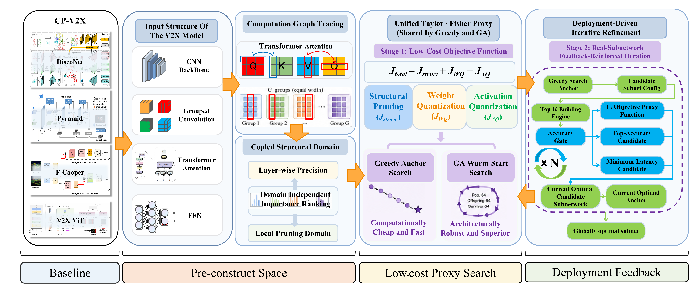

# HEAL Unified Structured Pruning and Mixed-Precision Search

本项目提供面向车路协同感知模型的统一、部署闭环搜索框架。它在同一个合法搜索空间中联合搜索结构化剪枝宽度和逐层精度，并以真实 TensorRT 子网反馈约束 GA，而不是只用理论 BOPS 或未物理化的掩码模型排序。

当前正式支持四个 HEAL LiDAR 模型族：

- Pyramid
- DiscoNet
- F-Cooper
- V2X-ViT

正式分支只包含可独立运行的源代码、配置模板、架构图和发布检查工具。数据集、原始 checkpoint、校准样本、ONNX、TensorRT engine、搜索日志和评估输出必须由使用者在运行时通过相对路径显式提供或指定，不属于版本库内容。

## 方法概览

```mermaid
flowchart LR
    A[HEAL model and checkpoint] --> B[Graph tracing]
    B --> C[Coupled legal pruning domains]
    B --> D[Layer-wise precision groups]
    C --> E[Taylor and Fisher proxy cache]
    D --> E
    E --> F[Greedy anchor search]
    F --> G[Beam budget recovery]
    G --> H[Strict BOPS anchor]
    H --> I[64-parent and 64-offspring GA]
    I --> J[Top-5 new candidates per generation]
    J --> K[Physical pruning and explicit Q/DQ]
    K --> L[TensorRT build and realization audit]
    L --> M[Fixed-manifest accuracy and latency]
    M --> N[Accuracy gate and real-subnetwork feedback]
    N --> I
    N --> O[Best deployable engine]
```



上图对应代码中的四个连续阶段：模型输入结构识别、计算图与耦合域构造、
Stage 1 低成本代理搜索、Stage 2 真实子网部署反馈。四个模型族共享同一个
候选表示、BOPS 门、Taylor/Fisher 统计、Greedy/GA 搜索器和 TensorRT 验收
合约；模型差异只由适配器、结构域规则和部署 wrapper 封装。



## Stage 1：统一 Taylor/Fisher 代理目标

对冻结校准 batch 上的任务损失 \(\mathcal L\)，结构门输出、权重和激活分别记为
\(z,w,a\)，其一阶梯度记为 \(g\)，对角 Fisher/二阶近似记为
\(h\simeq\mathbb E[g^2]\)。代码在逐元素取绝对值后再求和，避免不同坐标的正负项
相互抵消。

结构化剪枝只对合法耦合域中实际被删除的坐标
\(\mathcal R(c)\) 计分，\(\Delta z_i=-z_i\)：

$$
J_{\mathrm{struct}}(c)=
\sum_{i\in\mathcal R(c)}
\left(\left|g_{z_i}\Delta z_i\right|+
\frac{1}{2}\left|h_{z_i}(\Delta z_i)^2\right|\right).
$$

权重量化从基线精度沿合法相邻状态逐步下降。只在剪枝后仍保留的权重集合
\(\mathcal K(c)\) 上计算，且
\(\Delta w_i=Q_{p'}(w_i)-Q_p(w_i)\)：

$$
J_{WQ}(c)=\sum_{p\rightarrow p'}\sum_{i\in\mathcal K(c)}
\left(\left|g_{w_i}\Delta w_i\right|+
\frac{1}{2}\left|h_{w_i}(\Delta w_i)^2\right|\right).
$$

激活量化同样沿每个精度耦合组的相邻状态累加，在已映射的部署边界
\(\mathcal A(c)\) 上令
\(\Delta a_j=Q_{p'}(a_j)-Q_p(a_j)\)：

$$
J_{AQ}(c)=\sum_{p\rightarrow p'}\sum_{j\in\mathcal A(c)}
\left(\left|g_{a_j}\Delta a_j\right|+
\frac{1}{2}\left|h_{a_j}(\Delta a_j)^2\right|\right).
$$

Stage 1 原始代理函数为：

$$
F_1(c)=J_{\mathrm{total}}(c)=
J_{\mathrm{struct}}(c)+J_{WQ}(c)+J_{AQ}(c).
$$

在满足 \(\left|R_{\mathrm{BOPS}}(c)-R_{\mathrm{target}}\right|\le
0.005\) 的硬约束后，Greedy 和 GA 都以 **更小的 \(F_1\) 为更优**。搜索并非
主动让目标“缓慢增加”；只是压缩动作通常带来非负扰动，因此 Greedy 在向目标
BOPS 推进时累计风险往往单调增加，算法选择的是达到同一预算所需的最小增量。

- `J_struct`：功能门输出上的剪枝 Taylor/Fisher 代价，结构剪枝明确计入总目标。
- `J_WQ`：保留权重从当前精度切换到相邻低精度的量化扰动代价。
- `J_AQ`：激活 Q/DQ 边界的扰动代价；关闭时严格为零，开启但缺少统计时失败关闭。

`--activation-taylor on` 同时作用于 Greedy 和 GA；两者共享同一份冻结的
激活扰动统计与同一个 Stage-1 evaluator，不允许只在 GA 中启用。为避免三项
数值尺度不同造成某一类动作被系统性偏置，可选用训练校准子集拟合冻结目标：

$$
F_1^{\mathrm{cal}}=
\alpha_s\frac{J_{\mathrm{struct}}}{s_s}+
\alpha_w\frac{J_{WQ}}{s_w}+
\alpha_a\frac{J_{AQ}}{s_a}+
\alpha_{wa}\frac{J_{WQ}}{s_w}\frac{J_{AQ}}{s_a}.
$$

其中 `s_*` 只由 fit 候选的 median/IQR 确定，`alpha_*` 使用非负 Huber-NNLS
拟合。fit 与 validation 候选、Taylor 统计 batch 彼此分离；候选覆盖纯剪枝、
纯权重量化、纯激活量化和混合扰动。系数在 Greedy 与 GA 启动前冻结，报告同时
给出校准目标和原始直接相加目标在独立候选上的 Spearman、Top-K 召回率、BOPS
分桶一致性及候选类型覆盖率。

## Stage 2：真实子网目标与反馈锚点

Stage 2 对每代 Stage-1 排名前五且从未真实评估过的候选执行物理剪枝、显式
Q/DQ ONNX 导出、strongly typed TensorRT 构建、请求/实现精度核对，并在
冻结清单上测量 mAP 与 P50 forward 时延。设 Greedy 真实锚点的精度和时延为
\(m_g,t_g\)，候选为 \(m_c,t_c\)，正式精度容差
\(\tau=0.005\)：

$$
A_\tau(c)=\operatorname{clip}\left(
\frac{m_g-m_c}{\tau},-1,1\right),\qquad
F_2(c)=0.2A_\tau(c)+0.8\frac{t_c}{t_g}.
$$

只有满足以下条件的候选才有有限 \(F_2\)，并以 **更小的 \(F_2\) 为更优**：

$$
m_c\ge m_g-0.005,
$$

同时 engine 构建成功、请求精度与 TensorRT 实现精度完全一致、冻结帧全部评估
且没有跳帧。若同一个候选同时取得当代最高 mAP 和最低时延，则它直接成为当代
胜者；否则按 (F_2)、mAP、时延、参数/模型大小保留率、BOPS 偏差和稳定 hash
依次决胜。通用部署报告还记录
\(\eta_{AP}\max(0,m_{ref}-m_c)/\tau_{AP}+\eta_t t_c/t_{ref}\)，但正式 GA
存活与锚点更新使用上面的 Greedy 相对 (F_2)，二者不会混用。

真实反馈按如下闭环进入下一代：

1. 每代建立当代胜者，并在跨代档案中分别更新全局最低 (F_2)、全局最高
   mAP 和全局最低 P50 三类锚点。
2. 三类锚点与原始 Greedy 锚点按完整物理子网 hash 去重；同一子网可以同时
   拥有多个角色，不会重复占用种群位置。
3. 当代胜者、所有全局真实锚点和 Greedy 锚点被强制注入下一代 64 个存活
   个体，其余位置再由 Stage-1 排名补齐。
4. 下一代的同位点交叉和相邻合法变异从这个更新后的父代池产生，因此真实精度、
   时延和综合最优子网会持续指导后续子代，而不是只在搜索结束后用于报告。

上述反馈只改变父代组成，不在线重拟合 Stage-1 Taylor 系数，也不把真实 mAP
训练成黑盒代理，因而不会造成验证集反馈泄漏到预搜索统计中。

## 正式协议

默认 V3 协议固定如下：

| 项目 | 正式值 |
| --- | ---: |
| 父代 | 64 |
| 子代 | 64 |
| Stage 2 每代最多新候选 | 5 |
| 正式进化代数 | 10 |
| generation 0 | 仅初始化，不计入 10 代 |
| BOPS 绝对容差上限 | 0.005 |
| Greedy 精度门容差上限 | 0.005 mAP |
| CNN 每代 Top-5 筛选 | 300 帧，warmup 100 帧 |
| CNN 每代胜者复评 | 500 帧，warmup 200 帧 |
| V2X-ViT 每代 Top-5 筛选 | 500 帧，warmup 200 帧 |
| 每预算最终胜者验证 | 1789 帧，warmup 200 帧 |

Greedy 使用同一合法邻域和同一代理目标。直接轨迹无法进入预算带时，搜索会使用确定性的合法邻居 beam recovery；不会通过静默投影、通道补齐或事后 BOPS 修复伪造可行候选。

## 耦合搜索空间

结构基因不是独立删除单个参数，而是依照计算图预先构造可物理化的局部宽度域：

- 普通 CNN 通道沿 producer、BN、残差、concat、deblock、检测头等依赖闭包同步裁剪，并按固定 Taylor/Fisher 排序选择保留索引。
- 分组卷积保持原始 group 数，每个 group 删除相同数量的局部通道；depthwise 和普通 grouped convolution 分别使用各自的合法宽度规则。
- V2X-ViT attention 固定 head 数，搜索每个 head 的 `d_h`；同一索引在 Q/K/V、输出投影输入以及 HGT relation-attention/relation-message 张量上耦合裁剪。
- Transformer FFN 搜索 `d_ff`，第一层输出、第二层输入及对应 bias 使用同一固定重要性顺序同步裁剪；embedding、残差和 LayerNorm 宽度保持受保护。

### 量化位宽精度耦合层的构造

精度染色体不是按 ONNX 节点随意逐个赋位宽，而是从运行时张量流、物理权重
所有权和 Transformer 语义共同构造部署闭合的耦合组：

1. **完整加权层盘点。** 运行一次代表性 forward，记录所有实际执行的
   `Conv/ConvTranspose/Linear/MatMul/Gemm` 及调用次数；未被 trace 覆盖的
   加权层会失败关闭，每个可搜索模块必须且只能属于一个精度基因。
2. **强物理耦合。** 同一模块的多次调用以及共享同一物理 weight tensor 的
   别名使用同一个精度基因，组内统一选择 FP32、FP16 或 INT8，防止同一参数
   被要求以两种精度实现。
3. **CNN 合并边界。** residual add、concat、stack、multiply 等关系从运行时
   图显式保存。各分支加权计算可以独立选精度；进入功能合并前按
   `INT8 < FP16 < FP32` 推导公共精度并插入必要 DQ/cast，合并后的下一加权层
   再拥有自己的输入 Q/DQ，避免把整个残差块错误锁成一个位宽。
4. **Attention 耦合。** fused QKV 使用一个 `W32A32/W16A16/W8A8` 组；非融合
   attention 将 Q/K 投影绑定为一组、V 投影和输出投影分别成组。QK matmul
   与 LayerNorm 固定 FP32，softmax/AV 等功能边界只开放已经有显式 Q/DQ 和
   TensorRT 验收依据的状态。
5. **FFN 耦合。** 普通 FFN 的第一投影、激活边界、第二投影分别成组；gated
   FFN 将 gate/up 两个第一投影绑定为同一精度组，下投影独立。结构域中的
   `d_ff` 同步裁剪第一投影输出与第二投影输入，但结构宽度基因和精度基因仍是
   两个正交的合法位点。
6. **部署闭包。** 每组保存 canonical ONNX 节点、允许精度、激活边界、权重
   量化轴和合并策略。物理剪枝后重新映射 canonical 节点，INT8 权重采用
   per-channel 标度，激活使用冻结训练校准统计；任何缺失节点、fallback、
   额外 Q/DQ 或 TensorRT 实现精度不一致都会拒绝该候选。

因此，“逐层混合位宽”指以可独立部署的精度耦合组为最小搜索单元，而不是破坏
残差、共享权重或 QK 数值约束的裸层级自由组合。候选只有在实体参数形状、显式
Q/DQ 和 strongly typed TensorRT 层精度与请求完全一致时才可进入真实反馈。

## 目录

```text
heal_compress/
├── carla_integration/         # DAIR 对齐采集、坐标变换与外置 scatter 评测
├── configs/carla/             # 五场景无泄漏 CARLA 配置模板
├── pruning/                 # 结构化剪枝、依赖与物理化
├── quantization/            # 精度映射、显式 Q/DQ、TensorRT 插件
├── search/
│   ├── configs/unified/     # 四模型公开配置模板
│   ├── ga/                  # strict Stage 1/Stage 2 GA
│   ├── greedy/              # Greedy 与 beam recovery
│   ├── orchestration/       # 模型族正式执行器
│   ├── stage2/              # engine 构建、精度审计与评估
│   └── unified/             # 统一公开入口
├── scripts/                 # 数据清单、部署和辅助入口
├── trt_runtime/             # 正式 TensorRT runner 与动态 binding
├── assets/                  # 公开架构图
└── tools/check_public_release.py
```

内部开发分支可以维护测试与迭代文档；`-formal` 公开分支不包含 `tests/` 或
`docs/`，所有运行时功能均由正式包独立实现。

## 环境

建议建立独立环境，Python、CUDA、PyTorch、HEAL、ModelOpt 与 TensorRT 的版本必须彼此兼容：

```bash
conda create -n heal-unified-search python=3.10 -y
conda activate heal-unified-search
pip install -r requirements.txt
```

TensorRT/ModelOpt 可位于仓库外部。所有路径均从项目根目录解析，配置和命令中只使用相对路径。例如，当相邻目录保存 HEAL、TensorRT 和模型时：

```text
../HEAL
../TensorRT-10.9_x86_cu118
../model_zoo
../search_runs
```

不要把机器用户名、home 目录或数据盘绝对路径写进配置、脚本或环境变量。需要环境变量时也只赋相对值：

```bash
export MODEL_ROOT=../model_zoo
export TENSORRT_ROOT=../TensorRT-10.9_x86_cu118
export CALIBRATION_MANIFEST=../calibration/train_manifest.json
export EVALUATION_MANIFEST=../calibration/validation_manifest.json
export BASELINE_ENGINE=../model_zoo/baselines/strict_fp32.plan
```

正式评估默认使用 PyTorch CUDA 张量算子完成确定性硬体素化。原始点云由
DataLoader 保持为连续 FP32 张量，复制到 GPU 后按唯一 voxel/点序复合键排序，
每个 voxel 保留输入顺序中的前 N 个点；CARLA 与 DAIR-V2X 共用同一实现。
`--voxelization-backend cpu` 仅用于回归对照，不是正式性能口径。

## 统一入口

列出正式支持的模型：

```bash
python -m search.unified --list-families
```

只校验配置、模型族注册和调用计划，不加载模型、不构建 engine：

```bash
python -m search.unified \
  --config search/configs/unified/lidar_pyramid_ga.yaml \
  --output-root ./outputs/pyramid_dry_run \
  --dry-run
```

四个模板分别为：

```text
search/configs/unified/lidar_pyramid_ga.yaml
search/configs/unified/lidar_disco_ga.yaml
search/configs/unified/lidar_fcooper_ga.yaml
search/configs/unified/lidar_v2xvit_ga.yaml
```

### Pyramid

一个命令会先搜索并真实部署验证全部六个 Greedy 锚点；只有六个预算均通过后，才会启动正式 GA：

```bash
python -m search.unified \
  --config search/configs/unified/lidar_pyramid_ga.yaml \
  --checkpoint ../model_zoo/lidar_pyramid/model.pth \
  --model-config ../model_zoo/lidar_pyramid/config.yaml \
  --heal-root ../HEAL \
  --tensorrt-root ../TensorRT-10.9_x86_cu118 \
  --calibration-manifest ../calibration/pyramid_train.json \
  --output-root ../search_runs/pyramid_ga
```

### DiscoNet 与 F-Cooper

两者使用相同入口。严格 FP32 post-scatter 基线由当前代码和 checkpoint 在运行目录中重建，避免复用旧 fixed-K engine。将 `<family>` 分别替换为 `disco`、`fcooper`：

```bash
python -m search.unified \
  --config search/configs/unified/lidar_<family>_ga.yaml \
  --checkpoint ../model_zoo/lidar_<family>/model.pth \
  --model-config ../model_zoo/lidar_<family>/config.yaml \
  --heal-root ../HEAL \
  --tensorrt-root ../TensorRT-10.9_x86_cu118 \
  --calibration-manifest ../calibration/<family>_train.json \
  --output-root ../search_runs/<family>_ga
```

如只需完成六预算 Greedy 锚点搜索与真实部署门，可在同一命令中增加 `--search-method greedy`。该模式不会启动 GA。正式 GA 会在同一运行目录内复用已验证锚点的 engine，不会重复构建。

### V2X-ViT

V2X-ViT 的公开执行器在一次正式命令中完成 Greedy、beam recovery、真实 Greedy engine 锚点、10 代 strict GA、逐候选 TensorRT 构建和固定清单评估：

```bash
python -m search.unified \
  --config search/configs/unified/lidar_v2xvit_ga.yaml \
  --checkpoint ../model_zoo/lidar_v2xvit/model.pth \
  --model-config ../model_zoo/lidar_v2xvit/config.yaml \
  --heal-root ../HEAL \
  --tensorrt-root ../TensorRT-10.9_x86_cu118 \
  --calibration-manifest ../calibration/v2xvit_train200.json \
  --evaluation-manifest ../calibration/v2xvit_fixed1789.json \
  --physical-gpu 0 \
  --output-root ../search_runs/v2xvit_ga
```

四个模型使用同一 post-scatter engine 合约：动态 GPU 体素化、FP32 PFN 和 scatter 位于 TensorRT 外部，TensorRT 输入仅为 `spatial_features`、`pairwise_t_matrix`，需要固定双车掩码的模型另有 `agent_mask`。engine 不含点数或 voxel 数维度，不依赖 `fixed_K/MaxK`，也不加载 PointPillar scatter 插件。训练清单中的历史 voxel 统计只用于数据溯源，不能重新成为运行时容量约束。

评估清单至少应包含 200 个 warmup frame 和 1789 个冻结 evaluation frame。V2X-ViT 每代 Top-5 新候选使用固定 500 帧评估，每个预算的最终胜者复用同一 engine 完成 1789 帧验证。

Pyramid、DiscoNet 和 F-Cooper 使用三级真实评估协议：每代 Top-5 新候选固定 300 帧筛选，每代胜者复用原 engine 做固定 500 帧复评，最终预算胜者再次复用该 engine 做 1789 帧验证。任一级出现缺帧、跳帧、请求精度与实现精度不一致或 engine 验收失败，当前预算都会失败关闭。

激活 Taylor 可显式切换：

```bash
python -m search.unified ... --activation-taylor off
python -m search.unified ... --activation-taylor on
```

某模型族未绑定激活统计而选择 `on` 时，程序会失败关闭，不会退化成未声明的代理目标。

默认使用三项原始值直接相加。启用冻结任务损失校准目标：

```bash
python -m search.unified ... \
  --activation-taylor on \
  --objective-calibration huber-nnls
```

`huber-nnls` 要求激活 Taylor 已开启。校准样本只能来自训练或独立校准清单，
不得使用验证集、测试集或 Stage-2 反馈重新拟合系数。

可用单预算、单代 smoke 合约贯通真实 Greedy、GA Top-5、TensorRT 和最终验证链路：

```bash
python -m search.unified \
  --config search/configs/unified/lidar_v2xvit_ga.yaml \
  ... \
  --bops-target 0.10 \
  --generations 1 \
  --activation-taylor on
```

`--generations 1` 明确标记为 `formal_smoke_gen1`，用于最小化真实链路验收，不替代默认的 10 代正式搜索。种群、子代和每代 Stage-2 配额仍固定为 64、64 和 5；BOPS 与 accuracy gate 仍按正式协议失败关闭。

代理消融可使用 `--generations 3`，对应 `formal_experiment_gen3`。该合约保持
64 个父代、64 个子代、每代最多 5 个全新 Stage-2 候选以及完整的实体剪枝、
Q/DQ、TensorRT 和固定清单评估，仅缩短进化代数；它用于同配置比较，不替代
默认 10 代正式结果。

## 输出契约

所有生成文件只写入 `--output-root` 指定目录。典型结构为：

```text
<output-root>/
├── unified_search_plan.json
├── <experiment>/
│   ├── manifests/
│   ├── proxy/
│   ├── greedy/
│   ├── ga/
│   │   └── budget_*/
│   │       ├── stage2_screening_cache/
│   │       ├── generation_winner_validation/
│   │       └── final_full_validation/
│   ├── reports/
│   └── provenance/
└── best_engines/<family>/
    ├── best.plan
    └── best_engine_manifest.json
```

最佳 engine 使用硬链接发布；跨文件系统时自动退化为复制。清单记录源路径、目标路径与 SHA256。输出目录、checkpoint、ONNX、engine、缓存和日志均被 `.gitignore` 与发布审计双重拒绝。

## 评估纪律

- Fisher、量化和 intensity 等校准统计只能来自训练或独立校准子集。
- 阈值选择、超参数选择和 beam 配置只能使用开发集。
- 最终测试清单冻结后只运行一次，不得根据测试结果回调参数。
- TensorRT 与 FP32 必须使用相同帧、后处理、阈值和指标协议。
- 报告 AP@0.3、AP@0.5、AP@0.7、mAP、固定阈值 precision/recall、forward 延迟及端到端延迟。
- CARLA actor GT 与 DAIR 人工标注协议不同，跨数据集绝对 mAP 不应直接视为等价。

## DAIR-V2X GPU 评估

DAIR-V2X 的候选 TensorRT、严格 FP32 TensorRT 和 FP32 PyTorch 参考评估均默认
启用 GPU 体素化。每帧按真实点数生成动态 voxel 张量，随后在 CUDA 上执行候选
checkpoint 的 PFN 和 scatter，得到稠密 BEV 后才进入 TensorRT。该链路没有
`fixed_K` padding、截断或越界分支；审计记录真实 voxel 数、GPU 体素化时延、
PFN/scatter 时延、engine forward 和后处理时延。

FP32 PyTorch 和 FP32 TensorRT 基线可显式选择同一后端：

```bash
python scripts/evaluate_dair_lidar_pytorch_baselines.py \
  --models-root ../model_zoo/dairv2x \
  --eval-manifest ../calibration/validation_manifest.json \
  --heal-root ../HEAL \
  --output-dir ../search_runs/dair_fp32_pytorch \
  --physical-gpu 0 \
  --voxelization-backend gpu

python -m search.unified \
  --config search/configs/unified/lidar_pyramid_ga.yaml \
  --checkpoint ../model_zoo/lidar_pyramid/model.pth \
  --model-config ../model_zoo/lidar_pyramid/config.yaml \
  --calibration-manifest ../calibration/pyramid_train.json \
  --heal-root ../HEAL \
  --tensorrt-root ../TensorRT-10.9_x86_cu118 \
  --output-root ../search_runs/pyramid_post_scatter
```

结果同时记录 H2D、GPU 体素化、PFN/scatter、engine/model forward、GPU 后处理及
组合端到端时延，并写入逐帧 voxel 数与饱和 voxel 数用于审计。

## CARLA 接入

CARLA 与 DAIR 正式链路均将动态体素化、PFN 和 scatter 保留在 TensorRT 外部，候选 engine 从
稠密 `spatial_features` 与动态协作体 `pairwise_t_matrix` 边界开始。每帧原始
点数和 voxel 数可以变化，不使用 DAIR 验证集最大值构造固定 `MaxK`，也不静默
截断。采集器使用相对路面高度做端侧局部高度归一化，并严格执行 CARLA 左手系
到模型右手系的坐标变换。

启动独立服务并采集冻结的五场景数据：

```bash
CARLA_ROOT=../Carla/carla scripts/carla/start_carla_h800.sh 4 27910
python -m carla_integration.collect_scenes \
  --port 27910 \
  --config configs/carla/dair_v2x_no_leak_h800_test.yaml \
  --output ../search_runs/carla_blind_test
```

强度分位数映射必须只由 DAIR 训练集和独立 CARLA 校准地图冻结。搜索输出已是
post-scatter 显式 Q/DQ ONNX，可直接构建 TensorRT engine，并在同一
冻结清单上对候选、严格 FP32 TensorRT 和未剪枝 FP32 PyTorch 做配对评估：

```bash
python -m carla_integration.offline_evaluate \
  --data ../search_runs/carla_blind_test \
  --candidate-engine ../search_runs/candidate/deployment/engine.plan \
  --baseline-engine ../model_zoo/pyramid/post_scatter_fp32.plan \
  --checkpoint ../search_runs/candidate/pruned_checkpoint.pth \
  --fp32-checkpoint ../model_zoo/lidar_pyramid/net_epoch_bestval_at17.pth \
  --intensity-calibration ../calibration/carla_intensity_train_only.json \
  --model-config ../model_zoo/lidar_pyramid/config.yaml \
  --heal-root ../HEAL \
  --voxelization-backend gpu \
  --output ../search_runs/carla_candidate_report.json
```

正式报告必须同时给出 AP@0.3/0.5/0.7、mAP、固定 score floor 的
precision/recall、模型 forward 和组合端到端时延、相对 FP32 加速比，并记录
逐帧 voxel 数。天气在 CARLA 0.9.10 中不改变 LiDAR 物理，因此天气分组只用于
场景覆盖，不能冒充恶劣天气 LiDAR 鲁棒性结论。

## 发布检查

正式分支的独立卫生检查：

```bash
python tools/check_public_release.py
python -m search.unified --list-families
```

发布检查会拒绝：

- `docs/`、`output/`、`outputs/`、`search_results/` 和 `best_engines/`；
- `.pth`、`.onnx`、`.plan`、`.engine`、`.log`、`.jsonl` 等生成文件；
- 私有 home/data 路径和绝对路径占位符；
- 超过默认大小限制的文件。

完整 GPU 搜索会消耗较长时间并生成大量中间 engine。提交正式分支前至少必须
完成四配置 dry-run、公开卫生检查、生产模块导入检查，以及与改动范围匹配的
真实 engine smoke；这些检查不依赖公开仓库中的测试目录。

## 发布边界

正式发布只包含可复现框架，不包含机器状态：

- `docs/` 是本地开发与交接记录，不纳入 Git；
- `tests/` 只存在于内部开发分支，不纳入 `-formal` 公开分支；
- `outputs/`、`output/`、`search_results/`、`best_engines/` 及其任意嵌套形式均不纳入 Git；
- checkpoint、校准数组、ONNX、TensorRT engine、插件构建产物、缓存和日志均不纳入 Git；
- 路径只由相对配置、环境占位符或 CLI 参数提供，源代码不保存服务器绝对路径；
- `tools/check_public_release.py` 会基于 Git 待发布文件集合执行失败关闭检查。
